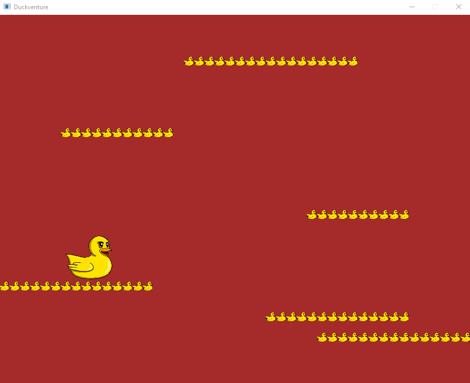
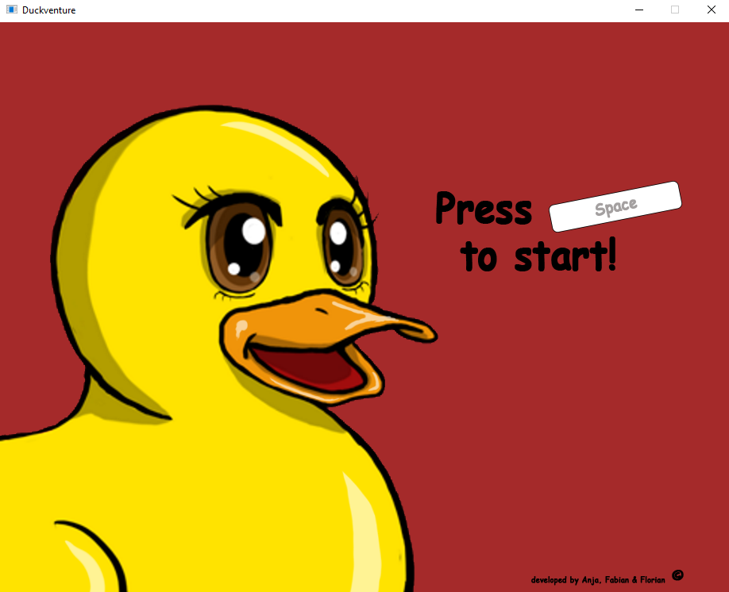

<h1>Stundenübersicht</h1>

<h3>Montag, 05.12.2016</h3>

Ideenfindung und generelle Konzeptentwicklung für das neue Projekt.

<h3>Montag, 12.12.2016</h3>

Wir haben uns in die Entwicklungsprogramme Greenfoot und MonoGame eingearbeitet. 
MonoGame konnten wir uns mithilfe des Videos "MoonTaxi" auf YouTube ansehen.  
(Link: https://www.youtube.com/watch?v=1VWGGs6axYc&t=778s&list=PLFOBQ8ri3LGwPnbKuZuPxbTZgB5dGPxkB&index=1)   
Somit konnten wir die beiden Programme vergleichen. Die Entscheidung fiel schließlich auf MonoGame.

<h3>Montag, 16.01.2017</h3>

An diesem Tag entstanden die ersten Ideen für die Geschichte unseres neuen Projektes. 
In der Klasse haben wir dazu unsere Projekte der ersten Abgabe besprochen.

<h3>Montag, 23.01.2017</h3>

In der Klasse haben wir über GitHub-Pages gesprochen und wie wir weitere Funktionen der Seite nutzen können, so wie den nächsten Abgabetermin festgelegt. 
In dieser Stunde haben wir mit dem Codieren in unserem Projekt in MonoGame begonnen.

<h3>Donnerstag, 26.01.2017</h3>

In der Ersten der Doppelstunden haben wir ein Google-Dokument erstellt. 
In diesem Dokument dokumentierten wir die Arbeit für GitHub, die wir weiter ausformulieren wollten. 
Es beinhaltet zum Beispiel wie man MonoGame installiert und auf welche Funktionen man achten sollte.
Dazu haben wir weitere Schritte für das Erstellen eines Projektes in MonoGame beschrieben.

<h3>Dienstag, 07.02.2017</h3>

Stefan gab eine sehr informative Vorstellung über GitHub-Pages. Die Präsentation kann man sich auf GitHub erneut anschauen, was einem neue Möglichkeiten bietet mit der Seite zu arbeiten. 
Wir können zum Beispiel ein html-Dokument mit einer Designvorlage erstellen und diese auf GitHub hochladen. 
	

<h3>Donnerstag, 09.02.2017</h3>

Für den Tag machten wir uns an die Dokumentation in GitHub-Pages. 
Wir schrieben die Fortschritte auf, die wir beim Codieren in MonoGame gemacht hatten.
Codiert haben wir das Einfügen von Bewegungen eines Objektes. 

<h3>Dienstag, 14.02.2017</h3>

Die Stunde nutzten wir, um die Dokumentation für die Codierung in MonoGame zu verbessern.
Währenddessen arbeiteten wir an unserem Projet weiter, wobei uns das Video auf YouTube als Stütze diente.

<h3>Donnerstag, 16.02.2017</h3>

Wir machten weitere Fortschritte bei unserem Projekt, indem wir Gravitation für alle Objekte im Bezugssystem einfügten. Dies dokumentierten wir ebenfalls auf GitHub.
Am Ende der Stunde schauten und testeten wir die Projekte der anderen Gruppen.

<h3>Dienstag, 21.02.2017</h3>

Am heutigen beschäftigten wir uns mit der Rechtschreibung unserer Dokumentation. Hierbei gingen wir alle Zeilen nacheinander durch und suchten meist vergeblich nach Fehlern. Bei diesem Tagebuch taten wir dasselbe, wobei wir ebenfalls auf wenige Fehler trafen. Ein weiterer Schritt war, dass wir die style.css zur Dokumentation hinzugefügt haben. Diese Datei beinhaltet das Layout der GitHub-Pages-Seite. Die Umbenennung der Bilder für die Dokumentation war der letzte Schritt des Tages, da es durch die bessere Benennung für uns und den Leser leichter ist die Bilder wiederzufinden.

<h3>Donnerstag, 23.02.2017</h3>

Wir fügten in unserem Projekt der Ente eine Bewegung zu. Diese Bewegung sah so aus, dass die Ente sich mithilfe der Pfeiltasten bewegen lassen kann. Das Ausprobieren des Spiels nahm nach diesem Schritt einige Zeit in Kauf, da wir zum ersten Mal etwas eigenes erschaffen hatten. Außerdem verbesserten wir die Gravitation der Ente im Bezugssystem, damit die Bewegungen der Ente geschmeidiger und schöner auf dem Bildschirm angezeigt werden.

<h3>Mittwoch, 01.03.2017</h3>

Die Implementierung des Bildes der Ente war der erste Schritt der Stunde. Das Bild hatte Anja zuvor zuhause mithilfe eines Zeichenpads gezeichnet. 

Nachdem die Ente in dem Projekt zu sehen war, änderten wir die Darstellung der Ente bei einem Richtungswechsel. Dazu drehten wir das Bild bei einem Richtungswechsel mithilfe eines Codeabschnitts. 

Die Einführung eines Scale war der nächste Schritt unserer Stunde, damit hatten wir den Anfang eines Startbilschirms geschaffen, in welchem die Ente von links in das Bild fährt. Codeänderungen wie die Umbenennung von "wurmi in enti" war ebenfalls Teil der Stunde, damit der Code auch auf den Titel des Projekts passt.

<h3>Donnerstag, 02.03.2017</h3>

In der Doppelstunde beschäftigten wir uns mit dem Sprung der Ente. Die Ente sollte unserer Meinung einen Doppelsprung vollführen können, damit das Spiel interessanter gestaltet wird. Die Begrenzung der Sprunganzahl der Ente war also Hauptbestandteil unserer Stunden. Außerdem änderten wir den Code für den Boden, da wir uns in den nächsten Stunden an die Implementierung einer Map machen wollten und der Boden für diese Map andere Eigenschaften besitzen musste.

<h3>Montag, 06.03.2017</h3>

An diesem Tag trafen wir uns am Tag zu einem gruppeninternen Fachtag. An diesem Fachtag beschäftigten wir uns mit dem hinzufügen von einem Weltvector im Projekt für einen größeren Bewegungsraum der Ente. Die in der letzten Stunde angesprochene Map war ebenso Teil des Tages. Sie erhielt Plattformen und Anzeichen von Wasser am Boden (das Wasser war zu diesem Zeitpunkt noch nicht sichtbar, sondern nur im Code vorhanden). 

Für die Erstellung der Map orientierten wir uns an dem Tutorial über MoonTaxi (oben bereits erwähnt). Wir zeichneten weitere Bilder für die Gestaltung des Bildschirm. Hierzu gehörte die Verbesserung der Ente, der Anfang eines Gegeners und die Textur für die Plattform. Die Kollision von Ente und Plattform wurde an diesem Tag fertiggestellt und auch die Startanimation wurde erweitert, sodass nun weitere Details erkennbar waren.

<h3>Mittwoch, 08.03.2017</h3>

Wir fixten an diesem Tag einen unbequemen Sprung-Bug und verbesserten wiedermal den Boden. Das Hinzufügen von Begrenzungen der Map nach links und rechts war Teil dieser Stunde, sowie ein Sterbecounter am oberen linken Rand des Bildschirm. Dieser Counter zählt die Tode des Spielers. Ein Tod entsteht, wenn die Ente sich an einem niedrigeren Ort befindet als dem Boden.

<h3>Donnerstag, 09.03.2017</h3>

In der Doppelstunde fügten wir den Gegner der Ente zum Projekt hinzu. Der Gegner war ein Hai in Form von einer Haiflosse, die über das Wasser schwimmt und sich immer um die x-Koordinate der Ente bewegt. Die Textur dieser Haiflosse entstand erst in den folgenden Tagen, weshalb wir mit einer improvisierten Textur arbeiteten, um es sich besser vorstellen zu können.

<h3>Dienstag, 14.03.2017</h3>

Das Steuerungstutorial war Teil dieses Tages. Es sollte dem Spieler des Spiels die Möglichkeit geben die Steuerung besser kennenzulernen, bevor er sich ins Abenteuer stürzt. Die Haiflosse erweiterten wir durch einen Hai, der aus dem Wasser springt und versucht die Ente zu erwischen. Dieser Sprung war etwas schwer hinzubekommen, jedoch schafften wir es nach einiger Zeit mit einer einfachen und optimalen Idee den Sprung vom Hai zu codieren. Die Erstellung von Wasser- und Plattformtexturen waren ebenfalls Teil der Stunde und wurde auch zuhause weitergeführt.

<h3>Donnerstag, 16.03.2017</h3>

Die Bilder für die Ente und den Hai wurden überarbeitet. Der Code wude für die Abgabe übersichtlicher gestaltet, damit fast jeder diesen mithilfe der Dokumentation, welche wir an diesem Tage weiterführten, nachvollziehen kann. Die Haiflosse erhielt eine Drehung bei einer Änderung der Richtung. 

<h3>Dienstag, 21.03.2017</h3>

An diesem Tag kam Frau Dr. Witte zu uns in den Unterricht und probierte Projekte aus. Unser Projekt probierte Sie ebenfalls und war sehr angetan von diesem. Im weiteren Verlauf der Stunde arbeiteten wir an der Dokumentation und diesem Tagebuch. Bei dem Code des Projekt optimierten wir die Zeichenebenen, sodass die Reihenfolge dieser stimmig war (Hai vor Plattform und vor Ente).

<h3>Donnerstag, 23.03.2017</h3>

Die Dokumentation hatte für uns höchste Priorität, weshalb wir uns die komplette Doppelstunde trotz Stundenausfall mit dieser beschäftigten und diese auch fertigstellen konnten. Wir waren also fertig für die Abgabe des Projektes am Freitag.
