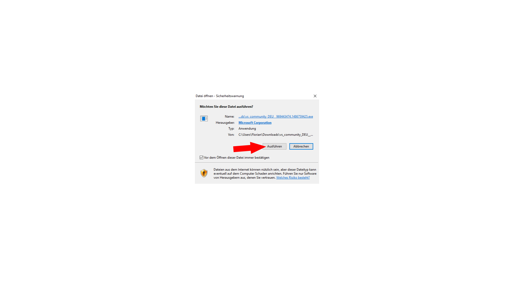
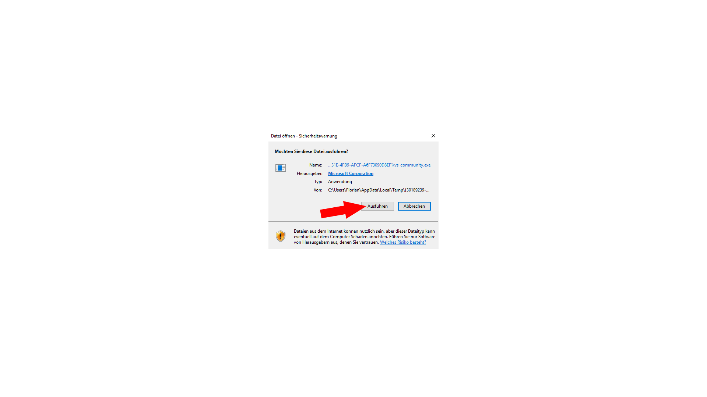
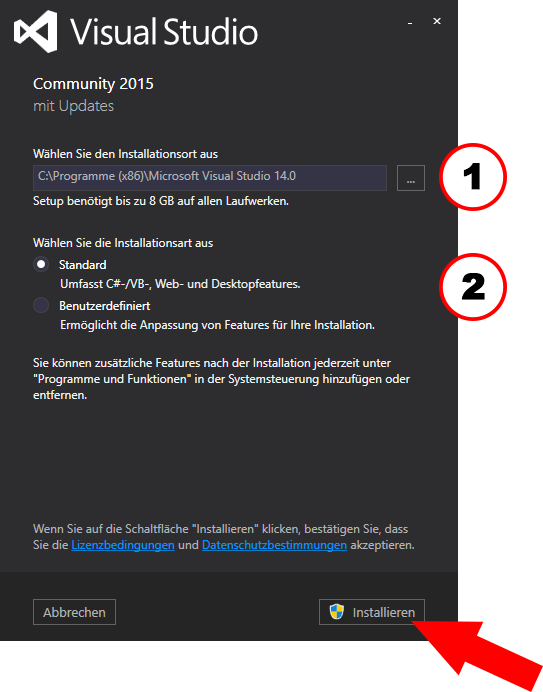
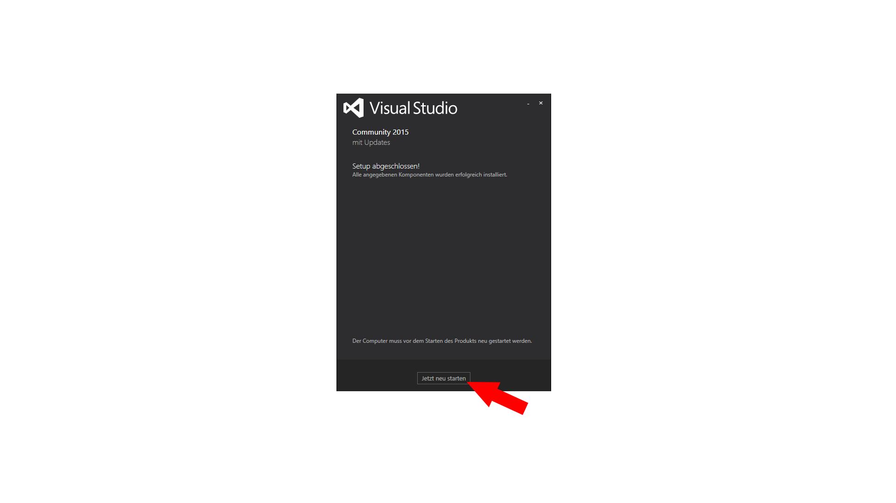
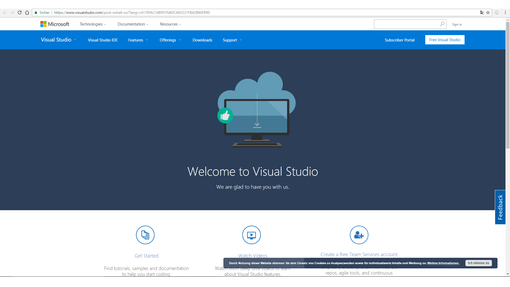
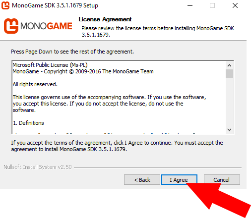
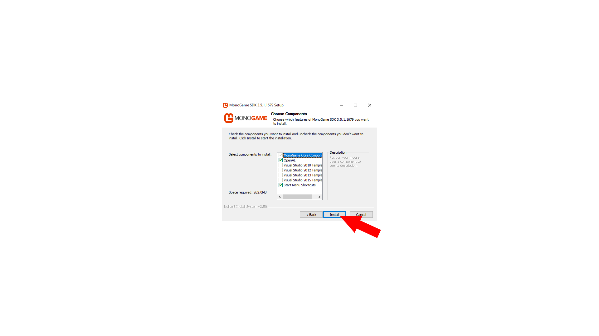

<h1>Tutorial: The Duckventure</h1>

<ol>
	<li><a href="#Nr1">Einleitung</a></li>
	<li><a href="#Nr2">Idee und Konzept</a></li>
	<li><a href="#Nr3">Einrichtung der IDE unter Windows</a></li>
		<ol>
			<li><a href="#Nr3.1">Installation Visual Studio</a></li>
			<li><a href="#Nr3.2">Installation MonoGame</a></li>
		</ol>
	<li><a href="#Nr4">Einrichten der IDE unter Linux</a></li>
	<li><a href="#Nr5">Starten des Projektes</a></li>
</ol>

<h2 id="#Nr1">Einleitung</h2>

Dieses Tutorial bezieht sich auf die Erstellung eines 2D Jump'n'Runs. F&uuml;r die Erstellung wird das Framework MonoGame in C&#35; verwendet. In diesem Tutorial geht es um die Installation von MonoGame unter dem Betriebssystem Windows.

<h2 id="#Nr2">Idee und Konzept</h2>

"The Duckventure" ist ein 2D Jump'n'Run, welches innerhalb des Informatikunterrichts entstanden ist. Zu diesem Zeitpunkt ist das Projekt noch in seinen Grundzügen, aber die Ersteller von dem Projekt sind drauf und dran es fertigzustellen.

Das Spiel wird sich in späteren Zügen per Tastatur (WASD) bedienen lassen. Das Konzept beläuft sich darauf, dass eine kleine Ente (eng: duck) durch die Welt läuft/hüpft und auf Grundlage einer spannenden Geschichte viele Abenteuer erlebt und bewältigt. Der genaue Verlauf dieser Geschichte steht noch nicht entgültig fest.

<h2 id="#Nr3">Einrichtung der IDE unter Windows</h2>
<h3>Installation Visual Studio</h3>

F&uuml;r die Installation von MonoGame wird das Programm Windows Visual Studio (z.B. &quot;Community 2015&quot;) ben&ouml;tigt.

&gt;&gt;&gt;<a href="https://www.visualstudio.com/de/downloads/" target="_blank">Hier downloaden</a>&lt;&lt;&lt;

Anschließend folgt man den nachstehenden Installationsanweisungen:

Öffnen der .exe (findbar beim Explorer unter &quot;Downloads&quot; &rarr; &quot;Downloads durchsuchen&quot; (oben rechts) &rarr; Eingabe von &quot;vs_community_DEU&quot; &rarr; Doppelklick auf die .exe)

Ausführen der .exe (C:\Users\User\Downloads\vs_community_DEU_969443474.1486759425.exe)

Ausführen der .exe auf dem lokalen Endgerät (C:\Users\User\AppData\Local\Temp\{30189239-...)

Auswahl des Installationsortes (Empfehlung: vorgegebenden Installationsort beibehalten) und Wahl der Installationsart. Für die Installation von MonoGame bietet sich die Installationsart &quot;Standard&quot; an. Bestätigen und starten der Installation mit Klick auf &quot;Installieren&quot;. Zu beachten ist, dass die Installation von Winows Visual Studio bis zu 8 GB auf den Laufwerken benötigen kann. Die Installationsdauer kann bis zu 80 Minuten dauern.

Nach dem Abschluss der Installation erscheint ein Fenster mit &quot;Setup abgeschlossen!&quot;. Das Programm Windows Visual Studio ist somit auf dem Endgerät installiert. Es kann nach dem Neustart des Endgerät gestartet und verwendet werden. Mit dem Klick auf &quot;Jetzt neu starten&quot; wird das Endgerät neu gestartet und das Produkt gestartet.

Nach dem erfolgreichen Neustart des Endgeräts öffnet sich die Internetseite von Windows Visual Studio und die Aussage &quot;Welcome to Visual Studio&quot; auf der Website bestätigt, dass die Installation erfolgreich verlaufen ist.

<i>Was ist Windows Visual Studio?</i>

"Windows Visual Studio" ist eine von dem Unternehmen Microsoft erstellte Entwicklungsumgebung ..... (weiterführen).

<h3>Installation MonoGame</h3>

Das Framework MonoGame muss anschließend gedownloadet und installiert werden.

&gt;&gt;&gt;<a href="http://www.monogame.net/downloads/" target="_blank">Hier downloaden</a>&lt;&lt;&lt;

Das Öffnen und Auführen der .exe führt zu dem Installationsverlauf. Hierbei sollte man die nachstehenden Installationsanweisungen beachten:

Bevor man bei dem ersten Installationsfenster auf &quot;Next&quot; klickt, sollte man alle anderen Anwendungen schließen, damit keine Komplikationen zwischen Updates und geöffneten Anwendungen entstehen können. Nach dem Schlie&szlig;en der anderen Anwendung kann man auf &quot;Next&quot; klicken und den Installationsvorgang fortsetzen.

Das Akzeptieren der Lizentvereinbarungen ist die Vorraussetzung zum Starten der Installation. Durch den Klick auf &quot;I Agree&quot; werden die Lizenzvereinbarungen akzeptiert.

Im n&aulm;chsten Schritt wählt man die Komponenten der Installation aus. Im optimalen Fall sind alle möglichen Installationskomponenten ausgew&aulm;hlt. Ist dies nicht der Fall sollte man alle möglichen Komponenten mit einem Hacken versehen. Die benötigte Speicherkapazit&aulm;t auf dem Endgerät wird unten links im Fenster angezeigt. Mit dem Klick auf Install startet die Installation. Die Dauer der Installation kann bis zu 5 Minuten beanspruchen.

Die Installation von MonoGame ist abgeschlossen. Mit einem Klick auf &quot;Finish&quot; schlie&szlig;t sich das Fenster.

<h2 id="Nr4">Einrichten der IDE unter Linux (Ubuntu)</h2>

In der offiziellen <a href="http://www.monogame.net/documentation/?page=main" target="_blank">MonoGame-Dokumentation</a> wird die <a href="http://www.monogame.net/documentation/?page=Setting_Up_MonoGame" target="_blank">Installation</a> ebenfalls beschrieben, wir konnten bei uns nicht alle Pakete installieren, funktionieren tut es aber trotzdem. Im Folgenden erklären wir die dortige Anleitung, wie sie zum Zeitpunkt unseres Projektes unter MonoGame Version 3.5 abl&auml;uft.
<h3>Installation der Pakete</h3>

Folgende Pakete werden vor der Installation von MonoGame ben&ouml;tigt:

<ul>
	<li>monodevelop</li>
	<li>libopenal-dev</li>
	<li>gtk-sharp3</li>
</ul>

Installation unter Ubuntu im Terminal (Strg + Alt + T) mit:

	sudo apt install monodevelop libopenal-dev gtk-sharp3

Nachdem man das Kennwort eingegeben hat, best&auml;tigt man die auftretende Frage mit "y" und lässt den Computer einen Moment computen.

So sollte die Ausgabe aussehen, wenn die Installation erfolgreich verlaufen ist.

<h3>Installation von MonoGame</h3>

Sobald letztere Pakete installiert sind, kann MonoGame (Download <a href="http://www.monogame.net/downloads/" target="_blank">hier</a> - aktuelle Version auswählen -> MonoGame *.* for Linux) installiert werden. Dafür navigiert man im Terminal zur Datei (normalerweise im Downloadordner), macht diese ausführbar und führt sie dann aus. Folgende Befehle (Jede Zeile ein Befehl) sind daf&uuml;r einzugeben:

	cd Downloads 
	chmod +x monogame-sdk.run 
	sudo ./monogame-sdk.run 

F&uuml;r den sudo-Befehl erneut das Passwort eingeben, die folgenden beiden Frage wieder mit "Y" beantworten und MonoGame wird installiert.

Nun ist die IDE Monodevelop mit installierten MonoGame-Addin im Startmen&uuml; zu finden.

<h2 id="#Nr5">Starten des Projektes</h2>
