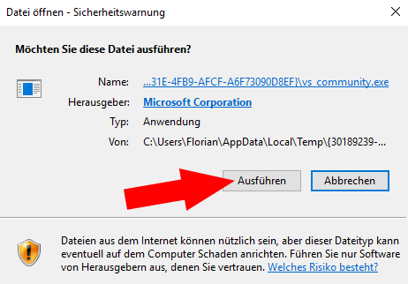
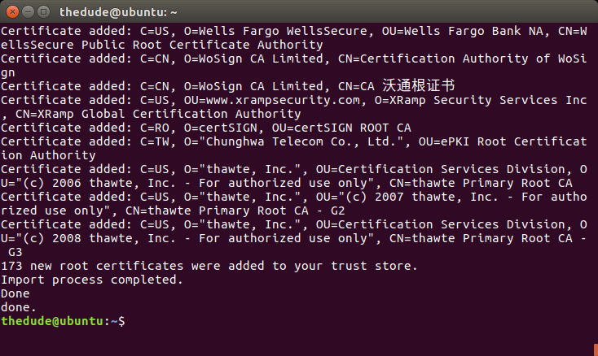
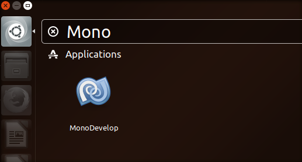
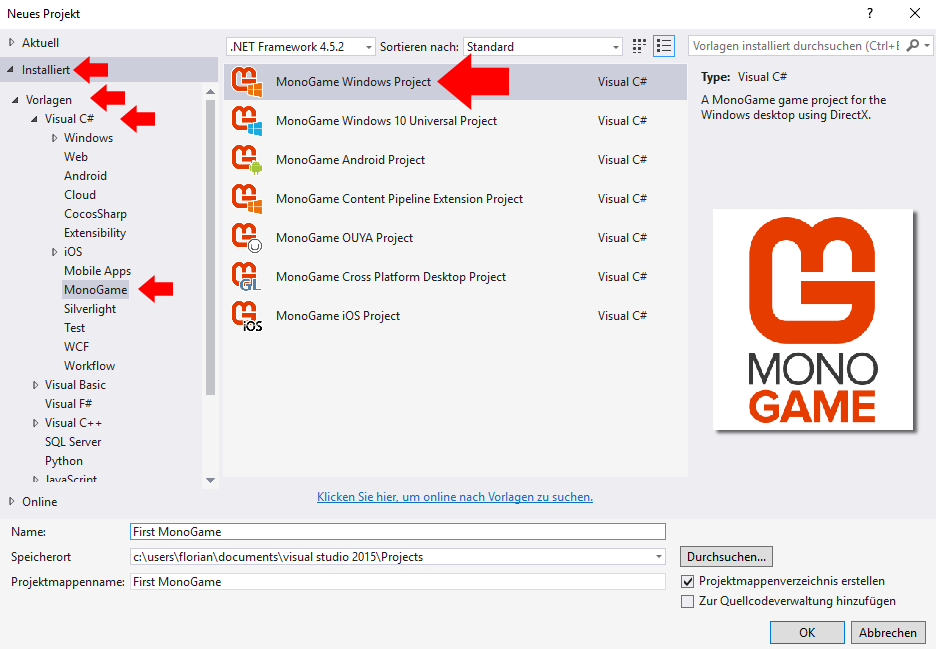
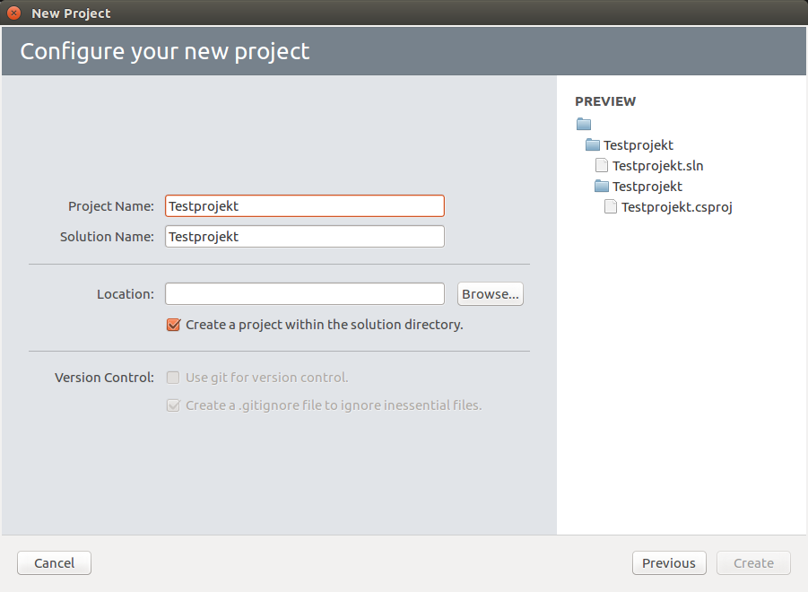

# Tutorial: The Duckventure

[1. Einrichtung der IDE unter Windows](#Nr1)

[1.1 Installation Visual Studio](#Nr1.1)

[1.2 Installation MonoGame](#Nr1.2)

[2. Einrichten der IDE unter Linux](#Nr2)

[2.1 Installation der Pakete](#Nr2.1)

[2.2 Installation von MonoGame](#Nr2.2)

[3. Anlegen eines Projektes](#Nr3)

[3.1 Anlegen in Visual Studio](#Nr3.1)

[3.2 Anlegen in MonoDevelop](#Nr3.2)

## 1. Einrichtung der IDE unter Windows

### 1.1. Installation Visual Studio

Für die Installation von MonoGame wird das Programm Windows Visual Studio (z.B. &quot;<i>Community 2015</i>&quot;) ben&ouml;tigt.

&gt;&gt;&gt;<a href="https://www.visualstudio.com/de/downloads/" target="_blank"><b>Hier downloaden</b></a>&lt;&lt;&lt;

Anschließend folgt man den nachstehenden Installationsanweisungen:

Öffnen der .exe (findbar beim Explorer unter &quot;Downloads&quot; &rarr; &quot;Downloads durchsuchen&quot; (oben rechts) &rarr; Eingabe von &quot;vs_community_DEU&quot; &rarr; Doppelklick auf die .exe)

Ausführen der .exe (C:\Users\User\Downloads\vs_community_DEU_969443474.1486759425.exe)

Ausführen der .exe auf dem lokalen Endgerät (C:\Users\User\AppData\Local\Temp\{30189239-...)

Auswahl des Installationsortes (<b>Empfehlung</b>: vorgegebenden Installationsort beibehalten) und Wahl der Installationsart. Für die Installation von MonoGame bietet sich die Installationsart &quot;<i>Standard</i>&quot; an. Bestätigen und starten der Installation mit Klick auf &quot;<i>Installieren</i>&quot;. Zu beachten ist, dass die Installation von Winows Visual Studio bis zu 8 GB auf den Laufwerken benötigen kann. Die Installationsdauer kann bis zu 80 Minuten dauern.

Nach dem Abschluss der Installation erscheint ein Fenster mit &quot;<i>Setup abgeschlossen!</i>&quot;. Das Programm Windows Visual Studio ist somit auf dem Endgerät installiert. Es kann nach dem Neustart des Endgerät gestartet und verwendet werden. Mit dem Klick auf &quot;<i>Jetzt neu starten</i>&quot; wird das Endgerät neu gestartet und das Produkt gestartet.

Nach dem erfolgreichen Neustart des Endgeräts öffnet sich die Internetseite von Windows Visual Studio und die Aussage &quot;<i>Welcome to Visual Studio</i>&quot; auf der Website bestätigt, dass die Installation erfolgreich verlaufen ist.

### 1.2. Installation MonoGame
Das Framework MonoGame muss anschließend gedownloadet und installiert werden.

&gt;&gt;&gt;<a href="http://www.monogame.net/downloads/" target="_blank"><b>Hier downloaden</b></a>&lt;&lt;&lt;

Das Öffnen und Auführen der .exe führt zu dem Installationsverlauf. Hierbei sollte man die nachstehenden Installationsanweisungen beachten:

Bevor man bei dem ersten Installationsfenster auf &quot;<i>Next</i>&quot; klickt, sollte man alle anderen Anwendungen schließen, damit keine Komplikationen zwischen Updates und geöffneten Anwendungen entstehen können. Nach dem Schlie&szlig;en der anderen Anwendung klickt man auf &quot;<i>Next</i>&quot;, um den Installationsvorgang fortzusetzen.

Das Akzeptieren der Lizentvereinbarungen ist die Vorraussetzung zum Starten der Installation. Durch den Klick auf &quot;<i>I Agree</i>&quot; werden die Lizenzvereinbarungen akzeptiert.

Im nächsten Schritt wählt man die Komponenten der Installation aus. Im optimalen Fall sind alle möglichen Installationskomponenten ausgewählt. Ist dies nicht der Fall sollte man alle möglichen Komponenten mit einem Hacken versehen. Die benötigte Speicherkapazität auf dem Endgerät wird unten links im Fenster angezeigt. Mit dem Klick auf Install startet die Installation. Die Dauer der Installation kann bis zu 5 Minuten beanspruchen.

Die Installation von MonoGame ist abgeschlossen. Mit einem Klick auf &quot;<i>Finish</i>&quot; schlie&szlig;t sich das Fenster.

## 2. Einrichten der IDE unter Linux (Ubuntu)

In der offiziellen <a href="http://www.monogame.net/documentation/?page=main" target="_blank">MonoGame-Dokumentation</a> wird die <a href="http://www.monogame.net/documentation/?page=Setting_Up_MonoGame" target="_blank">Installation</a> ebenfalls beschrieben, wir konnten bei uns nicht alle Pakete installieren, es funktionieren aber trotzdem. Im Folgenden erklären wir die dortige Anleitung, wie sie zum Zeitpunkt unseres Projektes unter MonoGame Version 3.5 abl&auml;uft.

### 2.1. Installation der Pakete

Folgende Pakete werden vor der Installation von MonoGame ben&ouml;tigt:

	monodevelop
	libopenal-dev
	gtk-sharp3

Installation unter Ubuntu im Terminal (Strg + Alt + T) mit:

	sudo apt install monodevelop libopenal-dev gtk-sharp3

Nachdem man das Kennwort eingegeben hat, best&auml;tigt man die auftretende Frage mit "<i>y</i>" und lässt den Computer einen Moment computen.

So sollte die Ausgabe aussehen, wenn die Installation erfolgreich verlaufen ist.

### 2.2. Installation von MonoGame

Sobald letztere Pakete installiert sind, kann MonoGame (Download <a href="http://www.monogame.net/downloads/" target="_blank">hier</a> - aktuelle Version auswählen -> MonoGame *.* for Linux) installiert werden. Dafür navigiert man im Terminal zur Datei (normalerweise im Downloadordner), macht diese ausführbar und führt sie dann aus. Folgende Befehle (Zu beachten: Jede Zeile ein neuer Befehl) sind daf&uuml;r einzugeben:

	cd Downloads 
	chmod +x monogame-sdk.run
	sudo ./monogame-sdk.run

F&uuml;r den sudo-Befehl erneut das Passwort eingeben, die folgenden beiden Frage wieder mit "<i>Y</i>" beantworten und MonoGame wird installiert.

Nun ist die IDE MonoDevelop mit installierten MonoGame-Addin im Startmen&uuml; zu finden.

## 3. Anlegen eines Projektes

Das Starten von einem MonoGame-Projekt ist von Betriebssystem zu Betriebssystem anders. Im Folgenden lassen sich die Tutorials zum Anlegen eines neuen Projektes für Windows und Linux finden.

### 3.1. Anlegen in Visual Studio

Starten von Windows Visual Studio. Das Programm ist unter der Liste nach dem Klick auf das Windows-Logo (unten Links) zu finden.
Beim ersten Starten von Windows Visual Studio ist eine Anmeldung mit einem Microsoft-Account nötig, außer man möchte das Programm nur im Testzeitraum von 30 Tagen benutzen. Die Anmeldung ist kostenlos und birgt keine späteren Kosten. Falls man bereits über einen Microsoft-Account verfügt, klickt man auf &quot;<i>Anmelden</i>&quot; und vollführt die Anmeldung mit dem Namen und der E-Mail-Adresse. Anderenfalls legt man sich einen Account unter &quot;<i>Registrieren</i>&quot; an und meldet sich anschließend an.

Um ein neues MonoGame-Projekt anzulegen, folgt man dem Reiter Datei -> Neu -> Projekt...

Im Fenster folgt man den Reitern Installiert -> Vorlagen -> Visual C&#35; -> MonoGame und wählt &quot;<i>MonoGame Windows Project</i>&quot; aus. Der Projektname, Speicherort und der Projektmappenname können im unteren Teil des Fensters angepasst werden. Mit dem Klick auf &quot;<i>Ok</i>&quot; wird das Projekt erstellt.

### 3.2. Anlegen in MonoDevelop

Unter Linux mit Monodevelop lässt sich ein Projekt relativ &auml;hnlich erstellen. Zuerst sucht man im Startmen&uuml; nach MonoGame und f&uuml;hrt es aus. Dann wird man von folgendem Interface begr&uuml;ßt:

Hier kann man unter &quot;<i>Solutions</i>&quot; auf &quot;<i>New...</i>&quot; ein neues Projekt erstellen.

Im n&auml;chsten Fenster wählt man links unter &quot;<i>MonoGame</i>&quot; - &quot;<i>App</i>&quot; ein &quot;<i>MonoGame Cross Platform Desktop Project</i>&quot;. Best&auml;tigen mit &quot;<i>Next</i>&quot;.

In diesem Fenster kann das Projekt benannt werden. Hierzu den gewünschten Projektnamen eingeben und den Speicherort (&quot;<i>Location</i>&quot;) auswählen. Mit &quot;<i>Create</i>&quot; (unten rechts) den Projektnamen bestätigen und das Projekt erstellen.
